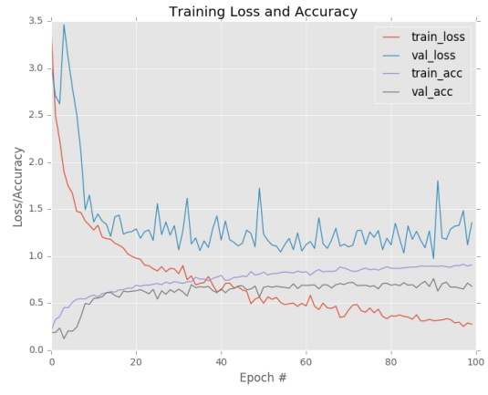

## 2.3 有数据增强和无数据增强的训练对比
&emsp;&emsp;在本小节的第一部分中，我们将讨论Flowers-17数据集，（这是一个非常小的数据集，相对于计算机视觉任务的深度学习来说），以及数据增强如何通过生成额外的训练样本来帮助我们人为地增加这个数据集的大小。我们将执行两个实验：<br/>
&emsp;&emsp;1. 在Flowers-17上没有使用数据增强来训练MiniVGGNet。<br/>
&emsp;&emsp;2. 在Flowers-17上使用数据增强来训练MiniVGGNet。<br/>
&emsp;&emsp;我们将发现，应用数据增强显著地减少了过拟合，并允许MiniVGGNet充分地获得更高的分类精度。<br/>

### 2.3.1 Flowers-17数据集
&emsp;&emsp;Flowers-17数据集<sup>[10]</sup>是一个细粒度的分类挑战，我们的任务是识别17种不同种类的花。该图像数据集非常小，总共有1360张图片，每个类仅有80张图片。计算机视觉任务应用深度学习的经验法则是让每个类下有1000-5000个样本，所以此处我们的样本有巨大的不足。<br/>
<div align=center></div>
<div align=center>图2.3：Flowers-17数据集中5个类（总共有17个）的样本，其中每一类代表一个特定花的品种。</div>
&emsp;&emsp;我们称Flowers-17为细粒度分类任务，是因为所有类别都非常相似（即花的种类）。实际上，我们可以把每一个类别看作子类别。类别是肯定不同的，但有大量共同的结构（如花瓣、雄蕊、雌蕊等）。对于深度学习的实践者来说，细粒度的分类任务往往是最具挑战性的
，因为它意味着我们的机器学习模型需要学习非常有区别性的特征，去区分那些非常相似的类。这种细粒度的分类任务因为我们有限的训练数据而变得更加困难。<br/>

### 2.3.2 感知方面预处理
&emsp;&emsp;到目前为止，我们仅通过将图像调整为固定大小来对其进行了预处理，而忽略了纵横比。在某些情况下，特别是对于基本基准数据集，这样做是可以接受的。<br/>
&emsp;&emsp;但是，对于更具挑战性的数据集，我们仍应争取将图像调整为固定大小，但是保持纵横比。 为了可视化此操作，请参看图2.4。<br/>
<div align=center></div>
<div align=center>图2.4：<b>左：</b>原始的输入图像（410×310）。<b>中：</b>忽略了纵横比将图像调整到256×256像素。注意到图像呈现出挤压和扭曲。<b>右：</b>保持图像纵横比将图像调整到256×256像素。</div>
&emsp;&emsp;在左侧，我们需要将输入图像调整为固定的宽度和高度。忽略纵横比情况下，我们将图像调整为256×256像素（中），有效地挤压和扭曲了图像，使其符合我们所需的尺寸。 一个更好的方法是考虑到图像的纵横比（右），我们首先按照较短的边调整尺寸，以使宽度为256像素，然后沿高度裁剪图像，以使高度为256像素。<br/>
&emsp;&emsp;虽然我们在裁剪过程中有效地丢弃了部分图像，但我们也保持了图像的原始纵横比。 保持一致的纵横比可以使我们的卷积
神经网络学习到更多具有区分性和一致性的特征。 这是当我们在使用本书剩余部分和ImageNet书的更高级数据集时将采用的一种常见技术。<br/>
&emsp;&emsp;为了看到感知方面的预处理如何实现，请更新我们的pyimagesearch工程结构去包含一个AspectAwarePreprocessor：<br/>

```
--- pyimagesearch
| |--- __init__.py
| |--- callbacks
| |--- nn
| |--- preprocessing
| | |--- __init__.py
| | |--- aspectawarepreprocessor.py
| | |--- imagetoarraypreprocessor.py
| | |--- simplepreprocessor.py
| |--- utils

```

&emsp;&emsp;请注意，我们如何在preprocessing子模块内部添加了一个名为Aspectawarepreprocessor.py的新文件。我们的新预处理器将在此位置运行。 打开Aspectawarepreprocessor.py并插入以下代码：<br/>

```Python
1 	# 导入必需的包
2 	import imutils
3   import cv2
4 	
5 	class AspectAwarePreprocessor:
6 	    def __init__(self, width, height, inter=cv2.INTER_AREA):
7 	        # 存储目标图像的宽度、高度和
8 	        # 当调整图像大小时使用的插值方法
9 	        self.width = width
10	        self.height = height
11	        self.inter = inter

```

&emsp;&emsp;就像在SimplePreprocessor中一样，我们的构造函数需要两个参数（目标输出图像需要的宽度和高度）以及当调整图像大小时使用的插值方法。 然后，我们可以定义preprocess函数如下：<br/>

```Python
13      def preprocess(self, image):
14			# 获取图像的尺寸grab the dimensions of the image and then initialize
15			# 并初始化裁剪时使用的增量.
16			(h, w) = image.shape[:2]
17			dW = 0
18			dH = 0

```

&emsp;&emsp;preprocess函数接受单个参数，即我们希望预处理的图像。第16行获取输入图像的宽度和高度，而第17和18行定义了当按较大尺寸裁剪时我们将使用的增量偏移量。 同样，我们的感知方面预处理程序是一个两步骤算法：<br/>
&emsp;&emsp;1. 步骤 #1：确定最短尺寸并按其调整尺寸。<br/>
&emsp;&emsp;2. 步骤 #2：按最大尺寸裁剪图像来获得目标宽度和高度。<br/>
&emsp;&emsp;如下代码块处理检查宽度是否小于高度，如果是，则按宽度调整大小：<br/>

```Python
20			# 如果宽度比高度小，
21			# 那么按宽度（即更小的尺寸）调整大小
22			# 然后更新增量去裁剪高度至目标
23			# 尺寸
24			if w < h:
25			    image = imutils.resize(image, width=self.width,
26			         inter=self.inter)
27			    dH = int((image.shape[0] - self.height) / 2.0)

```

&emsp;&emsp; 否则，如果高度小于宽度，则我们将按高度调整大小： <br/>

```Python
29			# 否则，高度比宽度小，所以
30			# 按照高度重新调整大小并按照宽度更新增量
31			# 用来裁剪
32			else:
33				image = imutils.resize(image, height=self.height,
34				     inter=self.inter)
35				dW = int((image.shape[1] - self.width) / 2.0)

```

&emsp;&emsp; 现在我们已经调整了图像的大小，我们需要重新获取宽度和高度，并使用增量保留图像的中心进行裁剪：<br/>

```Python
37			# 既然图像已经被调整大小了，
38			# 我们需要重新获取宽度和高度, 
39			# 紧随其后的时裁剪
40			(h, w) = image.shape[:2]
41			image = image[dH:h - dH, dW:w - dW]
42			
43			# finally, resize the image to the provided spatial
44			# dimensions to ensure our output image is always a fixed
45			# size
46			return cv2.resize(image, (self.width, self.height),
47				 interpolation=self.inter)

```

&emsp;&emsp; 当裁剪时（由于舍入误差），我们的图像相对与目标图像尺寸可能会偏离±1像素；因此，我们要调用cv2.resize来确保我们的输出图像具有所需的宽度和高度。 然后将预处理后的图像返回给调用函数。 既然我们已经实现了AspectAwarePreprocessor，当在Flowers-17数据集上训练MiniVGGNet结构时，我们就可以使用它了。<br/>

### 2.3.3 Flowers-17: 无数据增强
&emsp;&emsp; 首先，当在Flowers-17数据集上训练MiniVGGNet网络结构时，我们不使用数据增强来建立基线。 打开一个新文件，命名为minivggnet_flowers17.py，我们将写入如下代码：<br/>

```Python
1 	# 导入必需的包
2 	from sklearn.preprocessing import LabelBinarizer
3 	from sklearn.model_selection import train_test_split
4 	from sklearn.metrics import classification_report
5 	from pyimagesearch.preprocessing import ImageToArrayPreprocessor
6 	from pyimagesearch.preprocessing import AspectAwarePreprocessor
7 	from pyimagesearch.datasets import SimpleDatasetLoader
8 	from pyimagesearch.nn.conv import MiniVGGNet
9 	from keras.optimizers import SGD
10	from imutils import paths
11	import matplotlib.pyplot as plt
12	import numpy as np
13	import argparse
14	import os

```

&emsp;&emsp;第2-14行导入了我们所需的Python包。 对与这些导入库的大部分，你在以前已经见过了，但是我想请您注意下面：<br/>
&emsp;&emsp;1. 第6行：在这里，我们导入了新定义的AspectAwarePreprocessor。<br/>
&emsp;&emsp;2. 第7行：尽管使用了一个单独的图像预处理器，我们仍然可以使用SimpleDatasetLoader从磁盘加载我们的数据集。<br/>
&emsp;&emsp;3. 第8行：我们将在我们的数据集中训练MiniVGGNet网络结构。<br/>
&emsp;&emsp;接下来，我们解析我们的命令行参数：<br/>

```Python
16	# 构造参数解析并解析参数
17	ap = argparse.ArgumentParser()
18	ap.add_argument("-d", "--dataset", required=True,
19		help="path to input dataset")
20	args = vars(ap.parse_args())

```

&emsp;&emsp;我们在这里只需要一个参数，--dataset，这是到磁盘上的Flowers-17数据集目录的路径。<br/>
&emsp;&emsp;继续，从输入图像中抽取类标签：<br/>

```Python
22	# 获取图像路径的list，然后从图像路径中抽取
23	# 类标签名称
24	print("[INFO] loading images...")
25	imagePaths = list(paths.list_images(args["dataset"]))
26	classNames = [pt.split(os.path.sep)[-2] for pt in imagePaths]
27	classNames = [str(x) for x in np.unique(classNames)]

```

&emsp;&emsp;Flowers-17数据集有如下的目录结构：<br/>
```
flowers17/{species}/{image}
```

&emsp;&emsp;数据集中的图片有如下的目录结构：<br/>
```
flowers17/bluebell/image_0241.jpg
```

&emsp;&emsp;因此，为了提取类标签，我们可以在路径分隔符（第26行）分割得list上简单地提取倒数第二个索引来产生文本标签bluebell。 如果你想看看此路径和是如何提取出标签的，我建议打开一个Python shell并且玩玩文件路径和路径分隔符。 特别要注意的是，如何根据操作系统的路径分隔符来分隔一个字符串，然后使用Python索引来提取数组的各个部分。然后，第27行从图像路径中确定唯一的类别标签集（本例中为17个类别）。<br/>
&emsp;&emsp;给定我们的imagePaths，我们可以从磁盘加载Flowers-17数据集：<br/>

```Python
29	# 初始化the image preprocessors
30	aap = AspectAwarePreprocessor(64, 64)
31	iap = ImageToArrayPreprocessor()
32	
33	# 从磁盘加载数据集并归一化原始像素值到
34	#  [0, 1]范围
35	sdl = SimpleDatasetLoader(preprocessors=[aap, iap])
36	(data, labels) = sdl.load(imagePaths, verbose=500)
37	data = data.astype("float") / 255.0

```
&emsp;&emsp;第30行初始化了AspectAwarePreprocessor，以便它将每幅图像处理成64×64像素。 然后在第31行初始化ImageToArrayPreprocessor，使我们能够将图像转换为Keras兼容数组。 然后，我们分别使用这两个预处理器实例化SimpleDatasetLoader（第35行）。<br/>
&emsp;&emsp;第36行j将数据和相应的标签从磁盘上的加载。通过将原始像素值除以255，将数据集中的所有图像归一化为[0, 1]范围。<br/>
&emsp;&emsp;既然我们的数据集已加载，我们能够执行一次训练和测试拆分（75％的数据用来训练，25％的数据用于测试），以及one-hot编码我们的标签：<br/>
```python
39	# 将数据划分成训练集和测试集
40	# 75%的数据用于训练，25%的数据用于测试
41	(trainX, testX, trainY, testY) = train_test_split(data, labels,
42	test_size=0.25, random_state=42)
43	
44	# 将标签从整数转为向量
45	trainY = LabelBinarizer().fit_transform(trainY)
46	testY = LabelBinarizer().fit_transform(testY)
```
&emsp;&emsp;为了训练花朵识别器，我们将使用MiniVGGNet架构和SGD优化器：<br/>

```python
48	# 初始化优化器和模型
49	print("[INFO] compiling model...")
50	opt = SGD(lr=0.05)
51	model = MiniVGGNet.build(width=64, height=64, depth=3,
52	classes=len(classNames))
53	model.compile(loss="categorical_crossentropy", optimizer=opt,
54	metrics=["accuracy"])
55	
56	# 训练网络
57	print("[INFO] training network...")
58	H = model.fit(trainX, trainY, validation_data=(testX, testY),
59	batch_size=32, epochs=100, verbose=1)

```
&emsp;&emsp;MiniVGGNet架构将接受空间尺寸为64×64×3的图像（64像素宽，64像素高和3个通道）。 Flowers-17数据集中类的总数为len（classNames），在这种情况下，它等于十七。<br/>
&emsp;&emsp;我们将使用初始学习率a = 0.05的SGD训练MiniVGGNet。 我们会故意省略学习率衰减，以便我们可以证明数据增强在接下来的过程中将产生的影响。 58和59行训练MiniVGGNet，共计100轮。<br/>
&emsp;&emsp;然后，我们评估网络并绘制时间上的损失和准确性图：<br/>

```python
61	# evaluate the network
62	print("[INFO] evaluating network...")
63	predictions = model.predict(testX, batch_size=32)
64	print(classification_report(testY.argmax(axis=1),
65	predictions.argmax(axis=1), target_names=classNames))
66	
67	# plot the training loss and accuracy
68	plt.style.use("ggplot")
69	plt.figure()
70	plt.plot(np.arange(0, 100), H.history["loss"], label="train_loss")
71	plt.plot(np.arange(0, 100), H.history["val_loss"], label="val_loss")
72	plt.plot(np.arange(0, 100), H.history["acc"], label="train_acc")
73	plt.plot(np.arange(0, 100), H.history["val_acc"], label="val_acc")
74	plt.title("Training Loss and Accuracy")
75	plt.xlabel("Epoch #")
76	plt.ylabel("Loss/Accuracy")
77	plt.legend()
78	plt.show()

```
&emsp;&emsp;为了获得Flowers-17数据集上使用MiniVGGNet的基准精度，仅仅执行如下的命令：<br/>

```
$ python minivggnet_flowers17.py --dataset ../flowers17/images
[INFO] loading images...
[INFO] processed 500/1360
[INFO] processed 1000/1360
[INFO] compiling model...
[INFO] training network...
Train on 1020 samples, validate on 340 samples
Epoch 1/100
...
Epoch 100/100
3s - loss: 0.0030 - acc: 1.0000 - val_loss: 1.7683 - val_acc: 0.6206
[INFO] evaluating network...
           precision recall f1-score support
  bluebell      0.48   0.67     0.56      18
 buttercup      0.67   0.60     0.63      20
 coltsfoot      0.53   0.40     0.46      20
   cowslip      0.35   0.44     0.39      18
    crocus      0.62   0.50     0.56      20
  daffodil      0.43   0.33     0.38      27
     daisy      0.74   0.85     0.79      20
 dandelion      0.61   0.83     0.70      23
fritillary      0.72   0.82     0.77      22
      iris      0.80   0.76     0.78      21
lilyvalley      0.59   0.67     0.62      15
     pansy      0.82   0.74     0.78      19
  snowdrop      0.64   0.39     0.49      23
 sunflower      0.95   0.91     0.93      23
 tigerlily      0.88   0.74     0.80      19
     tulip      0.18   0.25     0.21      16
windflower      0.67   0.62     0.65      16
avg / total     0.64   0.62     0.62     340

```
&emsp;&emsp;从输出中可以看到，我们能够获得64％的分类准确性，考虑到我们有限的训练数据，这是相当合理的。 但是，关于我们的损失和精度图（图2.5）。如图所示，我们的网络再20轮训练后很快就开始过拟合了。这种行为的原因是我们只有1,020个训练样本，其中每个类有60个图像（其他图像用于测试）。 请记住，训练卷积神经网络时，理想情况下，我们应该拥有每个类的样本数在1,000-5,000之间。<br/>
<div align=center></div>  
<div align=center> 图2.5：MiniVGGNet应用到Flowers-17上无数据增强的学习图。在前25轮训练中当验证损失增加时过拟合时怎样开始的。</div>
&emsp;&emsp;此外，在最初的训练轮数中，训练准确性飞速增长，超过了95％，最终在以后轮数中获得
100％的精度–这个输出显然是过拟合的情况。 由于缺乏大量的训练数据，MiniVGGNet过于紧密地建模了训练数据，无法将其泛化到测试数据。 为了解决过拟合问题，我们可以应用正则化技术–-在本章中，我们的正则化方法将是数据
增强。 实际上，您还将包括其他形式的正则化（权重衰减，随机丢弃网络节点等）来进一步减少过拟合的影响。<br/>

### 2.3.4 Flowers-17: 具有数据增强
&emsp;&emsp;在这个案例中，我们将应用和前一部分同样的训练过程，仅仅有一处例外：我们将应用数据增强。为了看到数据增强屎如何提高我们的分类精度并抑制过拟合，建立一个新文件，命名为minivggnet_flowers17_data_aug.py，让我们开始吧：<br/>

```python
1 	# 导入必需的包
2 	from sklearn.preprocessing import LabelBinarizer
3 	from sklearn.model_selection import train_test_split
4 	from sklearn.metrics import classification_report
5 	from pyimagesearch.preprocessing import ImageToArrayPreprocessor
6 	from pyimagesearch.preprocessing import AspectAwarePreprocessor
7 	from pyimagesearch.datasets import SimpleDatasetLoader
8 	from pyimagesearch.nn.conv import MiniVGGNet
9 	from keras.preprocessing.image import ImageDataGenerator
10	from keras.optimizers import SGD
11	from imutils import paths
12	import matplotlib.pyplot as plt
13	import numpy as np
14	import argparse
15	import os

```
&emsp;&emsp;我们的导入包与minivggnet_flowers17.py一样，除了第9行，在那里我们导入ImageDataGenerator 类用来数据增强。<br/>
&emsp;&emsp;接下来，解析命令行参数并从图像路径中抽取类标签名称。<br/>

```python
17	# 构建参数解析并解析参数
18	ap = argparse.ArgumentParser()
19	ap.add_argument("-d", "--dataset", required=True,
20	help="path to input dataset")
21	args = vars(ap.parse_args())
22	
23	# 获取图像路径list，并从图像路径中抽取
24	# 类标签名称
25	print("[INFO] loading images...")
26	imagePaths = list(paths.list_images(args["dataset"]))
27	classNames = [pt.split(os.path.sep)[-2] for pt in imagePaths]
28	classNames = [str(x) for x in np.unique(classNames)]

```
&emsp;&emsp;从磁盘加载数据集，构建训练集和测试集划分，并编码我们的类标签。<br/>

```python
30	# 初始化 image preprocessors
31	aap = AspectAwarePreprocessor(64, 64)
32	iap = ImageToArrayPreprocessor()
33	
34	# 从磁盘加载数据集并将原始像素值归一化到
35	# [0, 1]范围
36	sdl = SimpleDatasetLoader(preprocessors=[aap, iap])
37	(data, labels) = sdl.load(imagePaths, verbose=500)
38	data = data.astype("float") / 255.0
39	
40	# 划分训练集和测试集
41	# 75%数据用来训练，25%数据用来测试
42	(trainX, testX, trainY, testY) = train_test_split(data, labels,
43	test_size=0.25, random_state=42)
44	
45	# 将类标签从整数转变成向量
46	trainY = LabelBinarizer().fit_transform(trainY)
47	testY = LabelBinarizer().fit_transform(testY)

```
&emsp;&emsp;下面的代码快非常重要，因为它初始化了ImageDataGenerator:<br/>

```python
49	# construct the image generator for data augmentation
50	aug = ImageDataGenerator(rotation_range=30, width_shift_range=0.1,
51	     height_shift_range=0.1, shear_range=0.2, zoom_range=0.2,
52	     horizontal_flip=True, fill_mode="nearest")

```
&emsp;&emsp;此处，我们将图像允许做如下处理：<br/>
&emsp;&emsp;1. 随机旋转±30度<br/>
&emsp;&emsp;2. 水平和垂直移动因子为0.2<br/>
&emsp;&emsp;3. 裁剪范围设为0.2<br/>
&emsp;&emsp;4.在[0.8, 1.2]范围内均匀采样来缩放<br/>
&emsp;&emsp;5. 随机水平翻转<br/>
&emsp;&emsp;你想要轻微调整这些数据增强值要取决与你的数据集。通常会看到旋转范围在[10， 30]之间，具体取决于你的应用。 水平和垂直移位通常在[0.1, 0.2]范围内（缩放值也一样）。 除非水平翻转图像会更改类标签，否则应始终包括水平翻转。<br/>
&emsp;&emsp;与以前的实验一样，我们将使用SGD优化器来训练MiniVGGNet：<br/>

```python
54	# 初始化优化器和模型
55	print("[INFO] compiling model...")
56	opt = SGD(lr=0.05)
57	model = MiniVGGNet.build(width=64, height=64, depth=3,
58	classes=len(classNames))
59	model.compile(loss="categorical_crossentropy", optimizer=opt,
60	metrics=["accuracy"])

```
&emsp;&emsp;不管怎样，用于训练网络的代码必须稍作更改，因为我们现在使用的是一个图像生成器。<br/>

```python
62	# 训练网络
63	print("[INFO] training network...")
64	H = model.fit_generator(aug.flow(trainX, trainY, batch_size=32),
65	    validation_data=(testX, testY), steps_per_epoch=len(trainX) // 32,
66	    epochs=100, verbose=1)

```
&emsp;&emsp;现在我们不是调用模型的.fit方法，而是需要调用.fit_generator。.fit_generator的第一个参数是aug.flow，它是我们的数据增强函数用于从训练数据中生成新的训练样本数据。 aug.flow要求我们传入训练数据
和相应的标签。 我们还需要提供批量大小，以便生成器可以构造训练网络时的恰当的批量。<br/>
&emsp;&emsp;然后，我们为validation_data提供一个2元组（testX，testY）-– 该数据用于在每轮结束时进行验证。 steps_per_epoch参数控制每个轮的批量次数-–我们可以通过编程方式确定适当的steps_per_epoch值：将训练样本的总数除以我们的批量大小，然后将其转换为整数。 最后，轮数控制着我们的网络应训练的总轮数，在这种情况下为100
轮。
&emsp;&emsp;训练完我们的网络后，我们将对其进行评估并绘制相应的精度/损失图：<br/>

```python
68	# 评估网络
69	print("[INFO] evaluating network...")
70	predictions = model.predict(testX, batch_size=32)
71	print(classification_report(testY.argmax(axis=1),
72	predictions.argmax(axis=1), target_names=classNames))
73	
74	# 绘制训练损失和精度图
75	plt.style.use("ggplot")
76	plt.figure()
77	plt.plot(np.arange(0, 100), H.history["loss"], label="train_loss")
78	plt.plot(np.arange(0, 100), H.history["val_loss"], label="val_loss")
79	plt.plot(np.arange(0, 100), H.history["acc"], label="train_acc")
80	plt.plot(np.arange(0, 100), H.history["val_acc"], label="val_acc")
81	plt.title("Training Loss and Accuracy")
82	plt.xlabel("Epoch #")
83	plt.ylabel("Loss/Accuracy")
84	plt.legend()
85	plt.show()

```
&emsp;&emsp;注意我们没有将数据增强应用到验证数据集。我们仅将数据增强用到训练集上。<br/>
&emsp;&emsp;为了在Flowers-17数据集上使用数据增强来训练MiniVGGNet，仅仅执行如下的命令：<br/>

```
$ python minivggnet_flowers17_data_aug.py --dataset ../flowers17/images
[INFO] loading images...
[INFO] processed 500/1360
[INFO] processed 1000/1360
[INFO] compiling model...
[INFO] training network...
Epoch 1/100
3s - loss: 3.4073 - acc: 0.2108 - val_loss: 3.0306 - val_acc: 0.1882
...
Epoch 100/100
3s - loss: 0.2769 - acc: 0.9078 - val_loss: 1.3560 - val_acc: 0.6794
[INFO] evaluating network...
  bluebell      0.67   0.44     0.53      18
 buttercup      0.59   0.80     0.68      20
 coltsfoot      0.56   0.50     0.53      20
   cowslip      0.45   0.50     0.47      18
    crocus      0.82   0.45     0.58      20
  daffodil      0.67   0.30     0.41      27
     daisy      1.00   0.95     0.97      20
 dandelion      0.63   0.96     0.76      23
fritillary      0.94   0.77     0.85      22
      iris      0.78   0.86     0.82      21
lilyvalley      0.44   0.73     0.55      15
     pansy      1.00   0.74     0.85      19
  snowdrop      0.54   0.65     0.59      23
 sunflower      1.00   0.96     0.98      23
 tigerlily      0.80   0.84     0.82      19
     tulip      0.22   0.25     0.24      16
windflower      0.72   0.81     0.76      16
avg /total      0.71   0.68     0.68      340

```
&emsp;&emsp;一旦网络完成训练后，您会发现准确性从64％提高到达到71％，比之前的运行提高了10.9％。 但是，并不能只看准确性---真正的问题是数据增强是否有助于防止过拟合。 为了回答这个问题，我们需要检查图2.6中的损失和精度图。<br/>
<div align=center></div>  
<div align=center> 图2.6：MiniVGGNet应用到带有数据增强的Flowers-17上。过拟合一直都是关注点；然而我们能够获得稳定的更高分类精度和更低的损失。</div>

&emsp;&emsp;尽管一直存在过拟合的情况，但使用数据增枪可以大大减轻这种影响。 同样，请记住，这两个实验是相同的---唯一的变化是我们是否应用了数据增强。 作为正则化器，你也可以看到数据增强会产生影响。 我们能够提高验证准确性，从而改善了模型的泛化性，尽管这降低了训练准确性。<br/>
&emsp;&emsp;通过随着时间的推移降低学习率可以获得更高的准确性。 学习率的设置超出了本章范围，因此当训练卷积神经网络时，我们可以将重点仅放在可以作为正则化器的数据增强上。<br/>


<br/>

---

<div align=right><a href="./2.4%20%E6%80%BB%E7%BB%93.md">2.4 总结</a></div>
<br/>