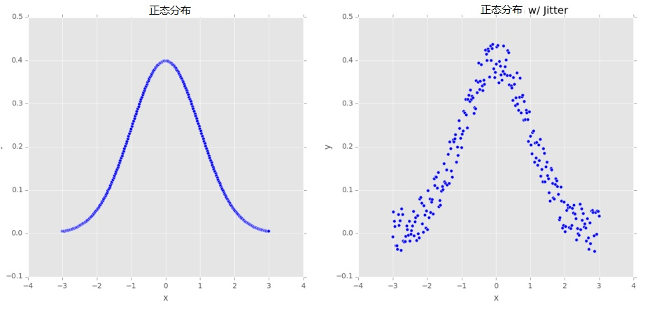

# 2.数据增强
&emsp;&emsp;根据Goodfellow等人的观点，正则化是“我们对一个学习算法做的任何修改，目的是去减少它的泛化误差而不是它的训练误差”<sup>[5]</sup>。简言之，正则化是减少我们的测试误差，可能会以增加少量的训练误差为代价。<br/>
&emsp;&emsp;我们已经在《入门卷》的第9章讨论了正则化的不同形式；然而，这些都是正则化的参数化形式，需要我们去更新我们的损失或更新函数。实际上，这儿还有正则化的其它形式：<br/>
&emsp;&emsp;1.修改自身的网络结构。<br/>
&emsp;&emsp;2.增强传递给训练网络的数据集。<br/>
&emsp;&emsp;Dropout是通过修改网络结构实现更好泛化性的一个很好的示例。我们插入一层，在这层随机断开前一层到后一层间的连接节点，确保没有单个节点负责学习怎样去表示一个给定类。<br/>
&emsp;&emsp;在本章的剩余部分，我们将讨论正则化的另一种类型，称为数据增强。这种方法的目的是干扰训练数据，在它们进入网络训练前，轻微地改变它们的外观。最终结果是一个网络始终看到从原始训练数据产生的新的训练数据，一定程度上减少了我们收集更多训练数据的需求（尽管一般来说，收集更多训练数据几乎不会损害你的算法）。<br/>
## 2.1.什么是数据增强
&emsp;&emsp;数据增强包含一系列用来生成新训练样本的技术，这些技术是通过对原始数据采用随机抖动和扰乱而类标签未变化来实现。我们应用数据增强的目标是增加模型的泛化性。鉴于我们的网络持续不断看到新的、稍微修改过的输入数据点，它能够学习更多鲁棒性。在测试时，我们不会应用数据增强来评估我们训练过的网络。在大多数情况下，你将看到测试准确性的提高，仅以轻微降低训练准确性为代价。
    <div align=center>   </div>
    <div align=center> 图2.1：**左：** 一个250个样本数据点严格服从正态分布。**右：** 添加了一些随机扰乱到此分布。这种数据增强能增加我们网络的泛化性。</div>
&emsp;&emsp;让我们先考虑图2.1左图的均值为零、方差为1的标准正态分布。在这个数据上训练一个机器学习模型可能导致我们严格模型化那个分布。当然，在实际应用中，数据很少会服从如此整齐的分布。<br/>
&emsp;&emsp; 相反，为了增加我们的分类器的泛化性，我们可能先沿着分布通过添加一些来自于随机分布的值来随机化扰动点（右图）。我们的图一直服从一个近似的正态分布，但是它和左图相比，不是一个完美的分布。一个依赖这个数据训练的模型，对于那些不被包含在训练集中的样本数据点更具有泛化性。<br/>
&emsp;&emsp; 在计算机视觉领域，数据增强是很自然的。例如，我们通过对原始图像添加简单的几何变换来获得额外的训练数据，诸如：<br/>
&emsp;&emsp;1.翻译<br/>
&emsp;&emsp;2.旋转<br/>
&emsp;&emsp;3.缩放<br/>
&emsp;&emsp;4.剪切<br/>
&emsp;&emsp;5.水平（有时，垂直）反转<br/>
&emsp;&emsp;对一幅输入图像应用少量的这些变换将轻微地改变它的外貌，但不会改变类标签，因此，使得数据增强成为一种非常自然和容易的方法应用到计算机视觉的深度学习上。关于应用到计算机视觉上的更高级的技术，包括给定色彩空间的颜色扰乱和非线性几何畸变。<br/>
## 2.2数据增强可视化
&emsp;&emsp;理解计算机上的数据增强最好的方法是去简单地可视化一个给定的输入图像成为增强的和扰动的图像。为了完成这个可视化，让我们建立一个简单的Python脚本，这个脚本使用Keras的内建库来实现数据增强。创建一个新文件并命名为augmentation_demo.py，写入如下的代码：
```Python
1    # 导入必要的包
2    from keras.preprocessing.image import ImageDataGenerator
3    from keras.preprocessing.image import img_to_array
4    from keras.preprocessing.image import load_img
5    import numpy as np
6    import argparse
```
&emsp;&emsp;行2-6导入我们需要的Python包。注意行2位置，我们从Keras导入ImageDataGenerator类到这个位置，这断代码将被用于数据增强并包含了所有帮助我们变换输入图像的相关方法。<br/>
&emsp;&emsp;接下来，我们解析命令行参数：<br/>
```Python
8    # 构建参数解析和解析参数
9    ap = argparse.ArgumentParser()
10   ap.add_argument("-i", "--image", required=True,
11   help="path to the input image")
12   ap.add_argument("-o", "--output", required=True,
13   help="path to output directory to store augmentation examples")
14   ap.add_argument("-p", "--prefix", type=str, default="image",
15   help="output filename prefix")
16   args = vars(ap.parse_args())
```
&emsp;&emsp;我们的脚本需要3个命令行参数，每个详细说明如下：
  * --image: 这是我们想要应用数据增强和可视化结果的输入图像路径。
  * --output: 对给定图像应用数据增强后，我们在磁盘上存储结果以便于我们能检查它，这个控制了输出目录。
  * --prefix: 一个字符串将被加到输出图像文件名上。如果我们要为图像分类预处理，就像如下所做：
```Python
18   # 加载输入图像，转变成Numpy数组, 然后
19   # 重新变型，让它有一个额外的维度
20   print("[INFO] loading example image...")
21   image = load_img(args["image"])
22   image = img_to_array(image)
23   image = np.expand_dims(image, axis=0)
```
&emsp;&emsp;我们现在准备初始化ImageDataGenerator:
```Python
25   # 为数据增强构建图像生成器，然后
26   # 初始化生成图像的总数
27   aug = ImageDataGenerator(rotation_range=30, width_shift_range=0.1,
28   height_shift_range=0.1, shear_range=0.2, zoom_range=0.2,
29   horizontal_flip=True, fill_mode="nearest")
30   total = 0
```

&emsp;&emsp;ImageDataGenerator类有大量的参数，本书不会枚举讲解所有这些参数。为便于查阅所有参数，请参看Keras官方文档(http://pyimg.co/j8ad8 )。<br/>
&emsp;&emsp;相反，我们将聚焦在增强参数上，这个是在你自己的应用中最可能使用的参数。参数 rotation_range 控制随机旋转的度数范围。此处，我们将允许输入图像随机旋转$\pm$30度。width_shift_range和height_shift_range分别用来水平和垂直平移。在此例中，参数值是给定范围的百分数，为10%。

&emsp;&emsp;shear_range控制逆时针方向变换的角度，在此范围内我们的图像将允许被剪切。zoom_range，浮点值，允许图像按照 [1 - zoom_range, 1 + zoom_range] 均匀分布来缩小或放大。

&emsp;&emsp;最终，horizontal_flip布尔值控制是否在训练过程中对输入图像进行水平翻转。对于大多数计算机视觉应用图像的水平翻转并不会改变类别标签结果，但是这些应用了水平翻转（垂直翻转）不会改变图像的语义。
注意到当应用这类数据增强是去轻微地修改输入图像，因此产生新的训练样本，并没有改变类标签本身。

&emsp;&emsp;一旦ImageDataGenerator被初始化，我们就能产生新的训练样本：

```Python
32    # 构建实际的Python生成器
33    print("[INFO] generating images...")
34    imageGen = aug.flow(image, batch_size=1, save_to_dir=args["output"],
35        save_prefix=args["prefix"], save_format="jpg")
36    
37    # 循环图像数据增强生成器产生的样本
38    for image in imageGen:
39        # increment our counter
40        total += 1
41    
42        # 如果达到了10个样本，跳出循环
43        if total == 10:
44            break
```

&emsp;&emsp;行34和行35初始化一个Python生成器来构建我们的增强图像。我们将传入我们的输入图像，其中batch_size为1（由于我们仅仅增强一张图像），连同一些额外的参数去说明输出文件路径、每个文件路径的前缀以及图像文件的格式。行38开始在imageGen生成器中对每一张图像循环。imageGen每次循环自动产生一个新的训练样本。我们就可以增加数据增强样本的总数，这些样本将被写到磁盘上，一旦我们达到了10个样本就停止执行脚本。

&emsp;&emsp;为了可视化运行中的数据增强，我们将使用图2.2（左），一张Jemma图像，我家的猎犬。为了产生Jemma的新训练样本图像，仅仅执行如下的命令：<br/>
```bash
$ python augmentation_demo.py --image jemma.jpg --output output
```
&emsp;&emsp;脚本执行后，你应该在输出目录中看到10张图像：<br/>
```bash
$ ls output/
  image_0_1227.jpg image_0_2358.jpg image_0_4205.jpg image_0_4770.jpg
  image_0_1933.jpg image_0_2914.jpg image_0_4657.jpg image_0_6934.jpg
  image_0_9197.jpg image_0_953.jpg
```