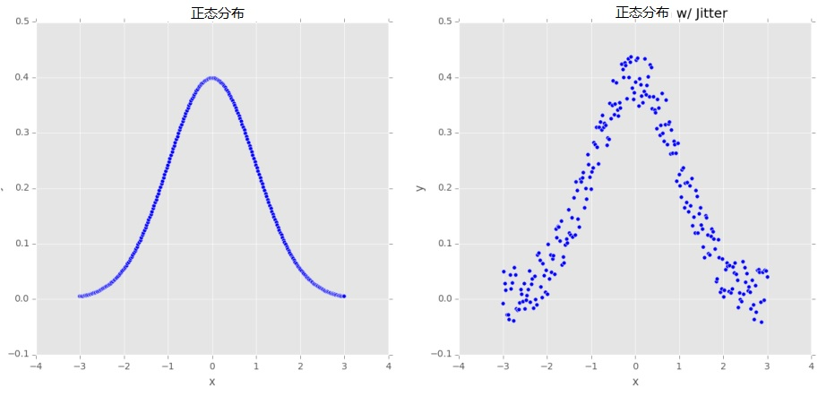

# 2.数据扩充
&emsp;&emsp;根据Goodfellow等人的观点，正则化是“我们对一个学习算法做的任何修改，目的是去减少它的泛化误差而不是它的训练误差”<sup>[5]</sup>。简言之，正则化是减少我们的测试误差，可能会以增加少量的训练误差为代价。<br/>
&emsp;&emsp;我们已经在《入门卷》的第9章讨论了正则化的不同形式；然而，这些都是正则化的参数化形式，需要我们去更新我们的损失或更新函数。实际上，这儿还有正则化的其它形式：<br/>
&emsp;&emsp;1.修改自身的网络结构。<br/>
&emsp;&emsp;2.扩充传递给训练网络的数据集。<br/>
&emsp;&emsp;Dropout是通过修改网络结构实现更好泛化性的一个很好的示例。我们插入一层，在这层随机断开前一层到后一层间的连接节点，确保没有单个节点负责学习怎样去表示一个给定类。<br/>
&emsp;&emsp;在本章的剩余部分，我们将讨论正则化的另一种类型，称为数据扩充。这种方法的目的是干扰训练数据，在它们进入网络训练前，轻微地改变它们的外观。最终结果是一个网络始终看到从原始训练数据产生的新的训练数据，一定程度上减少了我们收集更多训练数据的需求（尽管一般来说，收集更多训练数据几乎不会损害你的算法）。<br/>
## 2.1.什么是数据扩充
&emsp;&emsp;数据扩充包含一系列用来生成新训练样本的技术，这些技术是通过对原始数据采用随机抖动和扰乱而类标签未变化来实现。我们应用数据扩充的目标是增加模型的泛化性。鉴于我们的网络持续不断看到新的、稍微修改过的输入数据点，它能够学习更多鲁棒性。在测试时，我们不会应用数据扩充来评估我们训练过的网络。在大多数情况下，你将看到测试准确性的提高，仅以轻微降低训练准确性为代价。
    <div align=center>   </div>
    <div align=center> 图2.1：**左：** 一个250个样本数据点严格服从正态分布。**右：** 添加了一些随机扰乱到此分布。这种数据扩充能增加我们网络的泛化性。</div>
 &emsp;&emsp;让我们先考虑图2.1左图的均值为零、方差为1的标准正态分布。在这个数据上训练一个机器学习模型可能导致我们严格模型化那个分布。当然，在实际应用中，数据很少会服从如此整齐的分布。<br/>
&emsp;&emsp; 相反，为了增加我们的分类器的泛化性，我们可能先沿着分布通过添加一些来自于随机分布的值来随机化扰动点（右图）。我们的图一直服从一个近似的正态分布，但是它和左图相比，不是一个完美的分布。一个依赖这个数据训练的模型，对于那些不被包含在训练集中的样本数据点更具有泛化性。<br/>
&emsp;&emsp; 在计算机视觉领域，数据扩充是很自然的。例如，我们通过对原始图像添加简单的几何变换来获得额外的训练数据，诸如：<br/>
&emsp;&emsp;1.翻译<br/>
&emsp;&emsp;2.旋转<br/>
&emsp;&emsp;3.缩放<br/>
&emsp;&emsp;4.剪切<br/>
&emsp;&emsp;5.水平（有时，垂直）反转<br/>
&emsp;&emsp;对一幅输入图像应用少量的这些变换将轻微地改变它的外貌，但不会改变类标签，因此，使得数据扩充成为一种非常自然和容易的方法应用到计算机视觉的深度学习上。关于应用到计算机视觉上的更高级的技术，包括给定色彩空间的颜色扰乱和非线性几何畸变。<br/>
## 2.2数据扩充可视化
&emsp;&emsp;理解计算机上的数据扩充最好的方法是去简单地可视化一个给定的输入图像成为扩充的和扰动的图像。为了完成这个可视化，让我们建立一个简单的Python脚本，这个脚本使用Keras的内建库来实现数据扩充。创建一个新文件并命名为augmentation_demo.py，写入如下的代码：
```Python
1    # import the necessary packages
2   from keras.preprocessing.image import ImageDataGenerator
3    from keras.preprocessing.image import img_to_array
4    from keras.preprocessing.image import load_img
5    import numpy as np
6    import argparse
```
&emsp;&emsp;行2-6导入我们需要的Python包。注意行2位置，我们从Keras导入ImageDataGenerator类到这个位置，这断代码将被用于数据扩充并包含了所有帮助我们变换输入图像的相关方法。<br/>
&emsp;&emsp;接下来，我们解析命令行参数：<br/>
```Python
8    # construct the argument parse and parse the arguments
9    ap = argparse.ArgumentParser()
10   ap.add_argument("-i", "--image", required=True,
11   help="path to the input image")
12   ap.add_argument("-o", "--output", required=True,
13   help="path to output directory to store augmentation examples")
14   ap.add_argument("-p", "--prefix", type=str, default="image",
15   help="output filename prefix")
16   args = vars(ap.parse_args())
```
&emsp;&emsp;我们的脚本需要3个命令行参数，每个详细说明如下：<br/>
 * --image: 